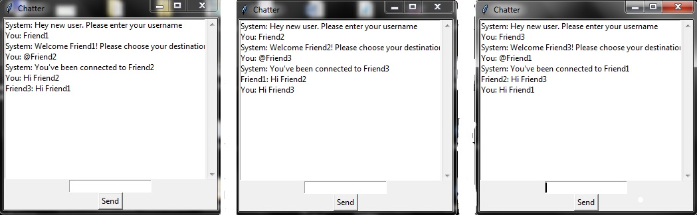

# mychat
An RSA end to end encrypted chat program written in python 
You can connect to anyone who has this mychat and you can chat completely safe. 
  

<h2>Setup</h2>
<ol>
  <li>Put the server.py file on your server and install python rsa module on it by pip install rsa</li>
  <li>Run client file on your personal computer.</li>
  <li>Enter your username.</li>
  <li>Connect to anyone you want by entering <b>@his/her username.</b></li>
  <li>And now, chat with complete security.</li>
</ol>

<h1>Attention</h1>
If you want to use mychat contact me for the client file. mohammad.armin.niknami@gmail.com
